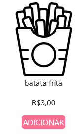
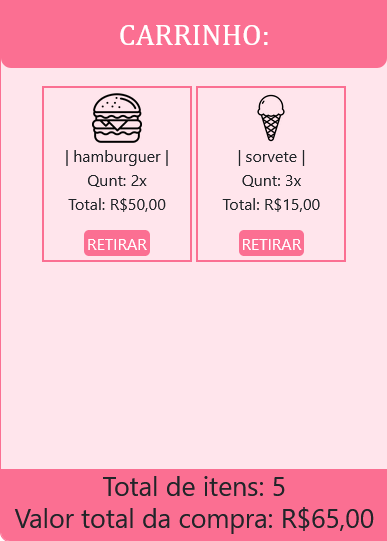
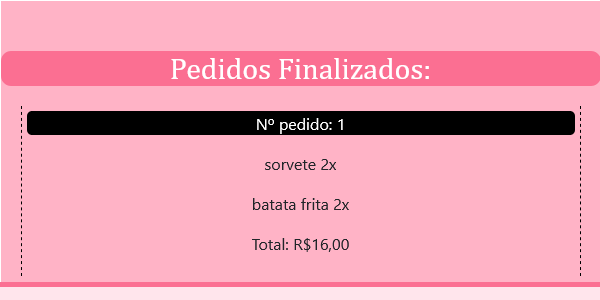

## Sistema de pedidos simples. 

_Selecione seu pedido quantas vezes quiser:_

_Click no botão carrinho:_

_Visualize os itens selecionados dentro do carrinho e os retire como achar melhor, automáticamente você irá conseguir visiualizar a quantidade total de itens e o valor:_

_Click em finalizar pedido quando já tiver selecionado os itens:_

_Role a tela e visualize a lista de pedidos:_

### ~~OBS::.. O sistema não foi criado com foco na experiência do usuário, tendo sido criado com foco no processo de aprendizado com JavaScript.~~